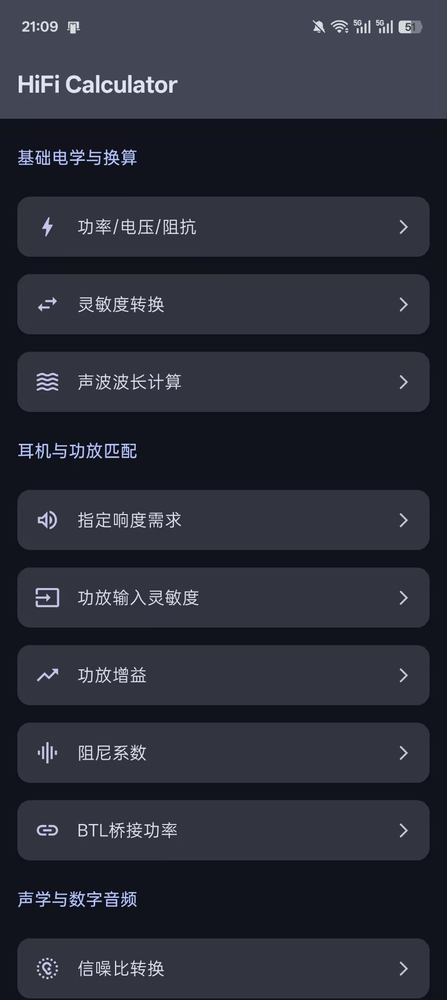

# HiFi Calculator

[](https://opensource.org/licenses/Apache-2.0)

一款专为高保真音频爱好者、DIY玩家和专业人士设计的现代化Android计算工具。

## 简介

HiFi Calculator 是一款综合性的移动应用，旨在将复杂、零散的音频相关计算简化并集中到一个现代化、易于使用的界面中。无论您是在匹配耳机与功放、估算数字音频文件大小，还是在分析听音环境，本应用都能为您提供精确、快捷的计算支持。



## ✨ Code is cheap, Show me your prompt

**该应用程序的几乎全部源代码、UI 设计概念、功能实现逻辑、矢量图标和此自述文件都是由 Google 的 Gemini 2.5 Pro 生成的。**

人类开发人员的角色主要是项目经理和总监：提供初始提示、用自然语言请求功能、识别错误并要求迭代改进。这展示了快速应用程序开发和原型设计的强大新范式。

## 功能特性

应用内的所有计算器都被精心组织在三大分类下，方便快速查找。

### 🔌 基础电学与换算 (Basic Electronics & Conversion)
- **功率/电压/阻抗**: 输入任意两个值（功率、电压、阻抗），自动计算第三个。支持 Vrms/Vp-p 和 W/mW 单位切换。
- **灵敏度转换**: 在耳机灵敏度单位 dB/V 和 dB/mW 之间进行双向转换。
- **声波波长计算**: 根据频率计算声波在空气中的波长。

### 🎧 耳机与功放匹配 (Headphone & Amplifier Matching)
- **指定响度需求**: 根据耳机灵敏度和阻抗，计算达到目标响度(dB SPL)所需的电压、功率和电流。
- **功放输入灵敏度**: 根据额定功率、阻抗和增益，计算功放达到满功率输出所需的输入电压。
- **功放增益**: 根据额定功率、阻抗和输入灵敏度，反向计算功放的增益(dB)。
- **阻尼系数**: 计算功放对扬声器/耳机的控制力指标。
- **BTL桥接功率**: 估算功放立体声转桥接单声道后的理论输出功率。

### 🔊 声学与数字音频 (Acoustics & Digital Audio)
- **信噪比转换**: 在分贝(dB)和噪声百分比(%)之间进行高精度双向转换。
- **动态范围/比特深度**: 计算数字音频的理论最大动态范围。
- **分贝合成**: 计算两个声压级(dB SPL)叠加后的总声压级。
- **Jitter (抖动) 转换**: 在皮秒(ps)和单位间隔(UI)之间进行双向转换。
- **音频文件大小/码率**: 计算未压缩音频(WAV)的文件大小和播放码率。
- **音频缓冲延迟**: 根据缓冲区大小(samples)和采样率计算音频处理延迟(ms)。

## 技术栈

本项目完全基于Google官方推荐的现代化Android开发技术栈构建：

- **语言**: [Kotlin](https://kotlinlang.org/)
- **UI框架**: [Jetpack Compose](https://developer.android.com/jetpack/compose)
    - **Compose UI**: 核心UI元素
    - **Compose Foundation**: 基础构建块
    - **Compose Material 3**: Google最新的Material Design设计系统实现
    - **Material Icons Extended**: 丰富的内置图标库
- **架构**: 单Activity, 多Composable屏幕
- **导航**: [AndroidX Navigation for Compose](https://developer.android.com/jetpack/compose/navigation)

## 构建指南

1.  克隆本仓库:
    ```bash
    git clone https://github.com/znzsofficial/HiFi-Calculator.git
    ```
2.  使用最新稳定版的 Android Studio 打开项目。
3.  等待 Gradle 完成依赖同步。
4.  在模拟器或物理设备上构建并运行应用。

## 📄 开源许可

本项目采用 **Apache License, Version 2.0** 开源许可。

详细信息请参阅 [LICENSE](LICENSE) 文件。